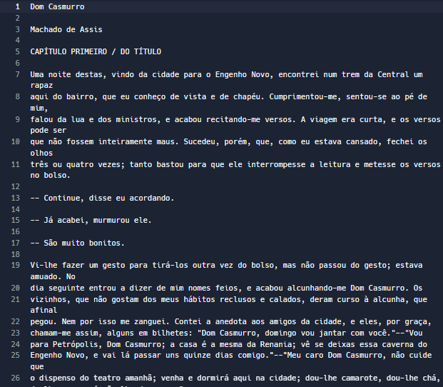
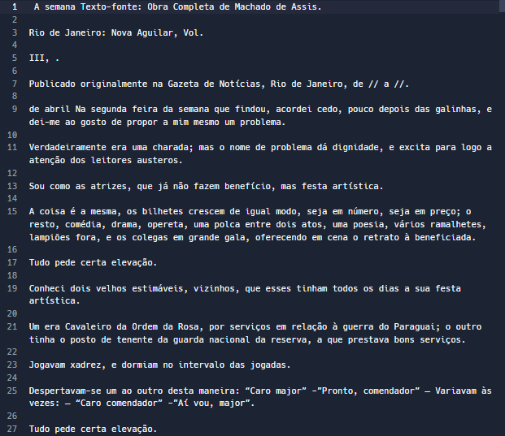
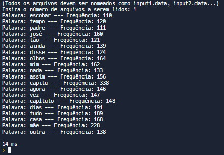
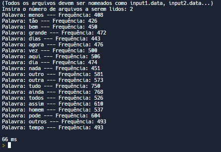

# Top K Elementos

O problema de encontrar os "top k itens" é uma tarefa comum, onde o objetivo é identificar os k elementos mais valiosos ou significativos a partir de uma grande coleção de dados. A necessidade de identificar esses elementos de alto valor surge em uma variedade de aplicações, tendo como exemplo a análise de dados e muito mais.

Este repositório explora a solução para o problema dos "top k itens" usando duas estruturas de dados essenciais: hash e heap. A combinação de uma tabela de hash eficiente e uma estrutura de heap possibilita a identificação dos k elementos mais valiosos de maneira otimizada. No cenário em que a coleção de dados é extensa, essa abordagem oferece uma forma de lidar com o desafio computacional de seleção dos principais elementos, mantendo o desempenho e a escalabilidade em mente.

O trabalho mostrado neste repositório tem como objetivo fazer a leitura e análise de diferentes textos fornecidos pelo usuário, podendo assim retornar os top K elementos mais frequentes apresentados nos textos. Por definição neste trabalho, k que é o número de elementos com mais frequência a serem obtidos terá o valor definido como 20, onde será apenas salvo e mostrado na tela apenas os 20 elementos mais frequentes nos textos fornecidos.

## Principais considerações

* Este programa deverá ler um arquivo contento um texto sem nenhuma formatação ("arquivo ASCII") onde cada sentença termina por um sinal de pontuação (".", "?", "!"");

* Cada parágrafo é separado por pelo menos uma linha em branco;

* Desconsirou-se, na análise a ser feita pelo seu programa, as "stop words", que não possuem conteúdo semântico. A lista de "stop words" deve ser fornecida através de um arquivo (stopwords.txt) na pasta dataset;

* Uma palavra é uma sequência de letras delimitada por espaço em branco, "coluna da esquerda", "coluna da direita" e símbolos de pontuação;

* Os arquivos de entrada são "inputN.data" (sendo N um número inteiro crescente iniciando-se apartir de 1) e "stopwords.txt";

* K está definido previamente no código como uma constante de tamanho 20;

## Desenvolvimento do problema

O desenvolvimento do algoritmo envolve:

1- Criação da Tabela de Disperção (Hash):

* Para cada palavra da coleção de dados de entrada, tokeniza-se o elemento e utiliza-se uma tabela de hash para contar a frequência de cada token. Isso permite uma contagem eficiente dos elementos em O(n) tempo.

2- Criação da Árvore de Prioridades (Heap) de Tamanho k:

* Inicialmente, insere-se os primeiros k elementos da tabela de hash em um heap de tamanho k. Isso cria uma estrutura inicial de itens mais valiosos.

3- Comparação e Atualização:

* Para cada elemento restante na tabela de hash, compara-se a contagem com o menor valor do heap (o elemento de menor frequência). Se a contagem for maior do que o menor valor da heap, o elemento de menor valor é removido, e o novo elemento é inserido no heap. Isso mantém a lista dos k itens de maior valor atualizada.

4- Impressão dos Resultados:

* Ao final do processo, a heap conterá os k elementos com maiores valores (frequências) da coleção de dados.

Deve-se ressaltar que o valor k mencionado para a construção do heap, está predefinido como 20, garantindo assim que seja criada uma hash com apenas 20 elementos.

Ao se iniciar o programa, foi preciso realizar a leitura das stopwords e adicionadas e um _unordered_set_. Após a leitura das stopwords, é necessário realizar a leitura do arquivo onde o mesmo foi realizado abrindo o arquivo de forma binária, permitindo assim pegar todo o conteúdo contido no arquivo e aloca-lo diretamente na memória.

A presença de caracteres especiais e a codificação do texto podem dificultar a leitura do arquivo quando tratados em ASCII. Se o texto estiver em uma codificação específica, é crucial assegurar que a leitura seja feita corretamente com o devido tratamento desses caracteres. Portanto, para lidar com a leitura de caracteres especiais, optou-se por utilizar a codificação UTF-8.

A leitura do arquivo pode ser sensível às diferenças entre letras maiúsculas e minúsculas, o que pode levar a falhas na correspondência. Por exemplo, ao procurar por "palavra", a substring "Palavra" não seria encontrada em um contexto sensível a maiúsculas e minúsculas. Para abordar isso, a função tolower() foi aplicada a todos os caracteres, garantindo que todas as letras fossem consideradas como minúsculas. Isso elimina a distinção entre letras maiúsculas e minúsculas.

Para a criação do heap foram utilizadas 3 funçãoes principais sendo elas:</p>
```make_heap```: responsável pela montagem do heap quando o mesmo estiver com todos os k elementos.</p>
```push_heap```: responsável por adicionar um novo elemento ao heap e garantir que as propriedades do heap sejam mantidas.</p>
```pop_heap```: responsável por remover o elemento no topo de um heap e, em seguida, reorganizar a estrutura do heap para restaurar suas propriedades após a remoção.</p>

Para a criação de uma hash foi utilzado o _unordered_map_, uma classe da biblioteca padrão do C++ que implementa uma tabela de hash, uma estrutura de dados que permite armazenar pares de chave-valor de forma eficiente e oferecer acesso rápido aos valores com base em suas chaves.

Para se realizar a leitura das palavras contidas nos textos e salva-las dentro da hash, foi feito a leitura de caractere por caractere construindo assim, as palavras que podem ser analisado os finais de cada palavra apardir do "\n", pois quando o mesmo for encontrado significa que foi alcançado o final de uma linha e assim, uma palavra foi totalmente construída.

Além disso, é importante observar que todas as sentenças presentes no arquivo de entrada serão finalizadas com ".", "!" ou "?", como está sendo lido um único caractere por vez, sempre que encontrarmos algumas das sentenças mencionadas pdemos concluir que a construção da palavra foi finalizada

Além dos espaços, sinais de pontuação e quebras de linha, não foram incluídos outros caracteres como parte das palavras, sendo eles:</p>
* ```,```</p>
* ```(```</p>
* ```)```</p>
* ```;```</p>
* ```/```</p>
* ```:```</p>
* ```—```</p>
* ```"```</p>
* ```'```</p>

Após a construção de cada palvra, era verificado se a mesma era uma stopword e em caso de stopword a palavra era simplesmente descartada, caso contrário a palavra era incluida na hash sendo ela uma chave para acessar um valor inteiro, sendo esse valor a frequência da palavra nos textos fornecidos.

## Decisões de implementação

Para se obter e salvar as palavras contidas nos arquivos, é criado uma varíavel _char_ onde se é feito a alocação de forma dinâmica do tamanho do arquivo e salvando todo conteúdo do mesmo na variável. Tal metódo utilizado para a leitura dos arquivos, apresentam tanto vantagens quanto desvantagens para a execução do programa. Algumas delas são: 

```Vantagens:``` </p>
* Leitura rápida e eficiente da variável em memória.
* Ideal para pequenos arquivos que cabem facilmente na memória.
* Menos operações de I/O de arquivo, o que pode economizar tempo.

```Desvantagens:``` </p>
* Se o arquivo for muito grande, pode consumir uma quantidade significativa de memória.
* Não é eficiente para arquivos muito grandes que não cabem na memória.

Após a análise das vantagens e desvantagens listadas, foi decidido utilizar deste metódo devido a extensa quantidade de leitura que seria executado mantendo o arquivo aberto, podendo assim causar uma lentidão no algoritmo, que por sua vez, pode ser mais prejudicial ao código do que consumir uma quantidade da memória para salvar todo conteúdo do texto em uma variável.

A leitura de stopwords por outro lado, foi feito diretamente do arquivo, devido a menor quantidade de ações referente a menor quantidade de operações realizadas com o arquivo. A seguir, podemos verificar algumas vantagens e desvantagens de tal metódo: 

```Vantagens:``` </p>
* Eficiente para arquivos muito grandes que não cabem na memória.
* Evita consumir toda a memória com o conteúdo do arquivo.
* Permite processar o arquivo em partes, o que pode ser útil para operações de busca, filtragem, etc.

```Desvantagens:``` </p>
* Pode haver mais operações de leitura/escrita no arquivo, o que pode ser mais lento.
* Pode ser mais complexo de implementar corretamente, especialmente para garantir a leitura correta de palavras, lidar com delimitadores, etc.

A ausência de certos caracteres especiais foi um dos grandes motivos para utilizar tal implementação pois não foi necessário a verificação de todos caracteres para analisar onde começa e onde se termina cada palavra. Outros fatores que influenciaram na escolha desta implementação, foi a maior facilidade de implementação e uma menor quantidade de operações de leitura no arquivo.

Foi decidido fazer tal implementação utilizando uma hash e um heap devido a complexidade do algoritmo, pois caso implementado adequadamente, o custo deste metódo é de O(n log k), onde n é o tamanho da coleção de dados e k é o número de itens mais relevantes. Por outro lado, caso decidido salvar todas as palavras no map e ordena-lo de acordo com a frequência das palavras para achar os top k elementos, teríamos um custo de O(n log n), sendo este um custo mais significativo para o algoritmo.

Para a impleeentação do heap, foi escolhido uma estrutura de heap mínimo devido a praticidade para encontrar o menor valor do heap caso contrário de um heap máximo, que seria mais trabalhoso para se encontrar o a palavra com menor frequência. Utilizando-se um heap mínimo, podemos a todo momento verificar e fazer a remoção apenas da raiz tornando assim mais eficiente a remoção do elemento.

## Funções do C++ utilizadas

### unordered_map</p>
O _unordered_map_ é uma classe em C++ que implementa um contêiner associativo baseado em tabela de hash. Ele permite armazenar pares de chave-valor, onde cada chave é usada para identificar exclusivamente o valor correspondente. Em outras palavras, ele é uma coleção de elementos, onde cada elemento possui uma chave única e um valor associado.

* <strong style="color:white">Organização Interna:</strong> </p>
O _unordered_map_ utiliza uma tabela de hash para organizar seus elementos internamente. Uma tabela de hash é uma estrutura de dados que mapeia chaves para valores através de uma função de hash. Isso permite que os elementos sejam acessados de maneira eficiente em tempo constante, na média.</p>
A especificação exata do hash code usado pelo unordered_map em C++ pode variar entre as implementações da linguagem e das bibliotecas padrão. Não há um hash code padrão único que se aplique a todas as situações, uma vez que diferentes implementações podem usar diferentes funções de hash.

* <strong style="color:white">Hashing e buckets:</strong> </p>
Ao adicionar elementos ao _unordered_map_, o valor de chave é passado por uma função de hash. Essa função converte a chave em um valor numérico chamado hash code. O hash code é usado para determinar o "balde" onde o elemento será armazenado. Cada balde é uma parte da tabela de hash que contém um ou mais elementos. A ideia é que, se a função de hash for bem distribuída, os elementos serão distribuídos uniformemente pelos baldes.

* <strong style="color:white">Tratamento de Colisões:</strong></p>
Como as chaves podem gerar o mesmo hash code (colisão), é necessário um mecanismo para resolver esse problema. O _unordered_map_ utiliza técnicas como listas ligadas ou árvores balanceadas dentro dos baldes para acomodar elementos com o mesmo hash code. Isso significa que vários elementos com chaves diferentes, mas que resultam no mesmo hash code, podem ser armazenados juntos e ainda serem acessados eficientemente.

* <strong style="color:white">Acesso e Inserção:</strong></p>
Quando você insere ou acessa um elemento no _unordered_map_, a classe calcula o hash code da chave usando a função de hash especificada e determina o balde correspondente. Em seguida, ele busca o balde para localizar o elemento, usando uma comparação das chaves. O acesso direto pelo operador [] também é suportado, permitindo que você obtenha o valor associado a uma chave específica de maneira conveniente.

* <strong style="color:white">Complexidade de Tempo:</strong></p>
A complexidade de tempo médio para acessar, inserir ou remover um elemento de um _unordered_map_ é O(1), considerando que a função de hash seja distribuída uniformemente. No entanto, em casos raros de colisões excessivas, o pior caso pode ser O(n), onde n é o número total de elementos.

* <strong style="color:white">Considerações:</strong> </p>
É importante notar que, embora o acesso seja rápido em média, a ordem dos elementos dentro do _unordered_map_ não é garantida. Se a ordem é relevante, o _unordered_map_ pode não ser a melhor escolha, e você pode preferir usar o std::map.

* <strong style="color:white">Conclusão:</strong> </p>
O unordered_map é uma ferramenta poderosa para armazenar e recuperar dados associados a chaves de maneira eficiente. Ele utiliza tabelas de hash para permitir acesso rápido aos elementos e lida com colisões usando técnicas apropriadas. Entender seu funcionamento interno ajuda a escolher a estrutura de dados certa para cada situação.

### unordered_set</p>
O unordered_set é uma classe em C++ que implementa um contêiner associativo baseado em tabela de hash. Ele permite armazenar elementos únicos, onde cada elemento é usado como uma chave de busca para recuperação rápida. Em outras palavras, ele é uma coleção de elementos únicos, sem repetição.

* <strong style="color:white">Organização Interna:</strong> </p>
O unordered_set utiliza uma tabela de hash para organizar seus elementos internamente. Assim como o unordered_map, uma tabela de hash é uma estrutura de dados que mapeia valores para posições na tabela através de uma função de hash. Isso permite que os elementos sejam acessados de maneira eficiente em tempo constante, na média.

* <strong style="color:white">Hashing e buckets:</strong> </p>
Quando você insere elementos no unordered_set, o valor do elemento é passado por uma função de hash. Essa função converte o valor em um valor numérico chamado hash code. O hash code é usado para determinar o "balde" onde o elemento será armazenado. Cada balde é uma parte da tabela de hash que contém um ou mais elementos. A ideia é que, se a função de hash for bem distribuída, os elementos serão distribuídos uniformemente pelos baldes.

* <strong style="color:white">Tratamento de Colisões:</strong> </p>
Assim como no unordered_map, o unordered_set também lida com colisões, que ocorrem quando dois elementos geram o mesmo hash code. Ele utiliza técnicas como listas ligadas ou árvores balanceadas dentro dos baldes para acomodar elementos com o mesmo hash code.

* <strong style="color:white">Acesso e Inserção:</strong> </p>
Quando você insere ou acessa um elemento no unordered_set, a classe calcula o hash code do valor usando a função de hash especificada e determina o balde correspondente. Em seguida, ele busca o balde para localizar o elemento, usando uma comparação dos valores. Isso permite a recuperação rápida de elementos exclusivos.

* <strong style="color:white">Complexidade de Tempo:</strong> </p>
A complexidade de tempo médio para acessar, inserir ou remover um elemento de um unordered_set é O(1), considerando que a função de hash seja distribuída uniformemente. No entanto, em casos raros de colisões excessivas, o pior caso pode ser O(n), onde n é o número total de elementos.

* <strong style="color:white">Considerações:</strong> </p>
O unordered_set é uma ferramenta poderosa para armazenar e recuperar elementos exclusivos de maneira eficiente. No entanto, é importante observar que a ordem dos elementos dentro do unordered_set não é garantida. Se a ordem é relevante, o std::set pode ser uma escolha melhor.

* <strong style="color:white">Conclusão:</strong> </p>
O unordered_set é uma estrutura de dados eficiente para armazenar e gerenciar elementos únicos usando uma tabela de hash. Ele aproveita o poder da computação de hash para fornecer acesso rápido aos elementos e lida com colisões de maneira adequada. Compreender seu funcionamento interno ajuda a escolher a estrutura de dados certa para diferentes situações.

### make_heap</p>
A função make_heap faz parte da biblioteca de algoritmos em C++ e é usada para criar uma estrutura de heap a partir de uma sequência de elementos. Um heap é uma estrutura de dados especial em forma de árvore que mantém a propriedade do maior (ou menor) elemento estar na raiz. A função make_heap é frequentemente usada como parte do processo de construção de um heap.

* <strong style="color:white">Organização Interna:</strong> </p>
Internamente, a função make_heap usa um processo chamado "heapify", que é uma técnica para transformar uma sequência de elementos em um heap. Esse processo reorganiza os elementos de modo que a propriedade do heap seja mantida. Em um heap máximo (max heap), o pai é sempre maior do que seus filhos. Em um heap mínimo (min heap), o pai é sempre menor do que seus filhos.</p>
O make_heap executa as trocas e ordenação da seguinte forma:</p>
1- O algoritmo começa do último nó pai na árvore (o pai do último elemento da sequência) e prossegue até o primeiro elemento.</p>
2- Para cada nó pai, o algoritmo compara o valor do pai com os valores de seus filhos.</p>
3- Se o valor de um filho for maior do que o valor do pai, ocorre uma troca entre o pai e o filho de maior valor.</p>
4- Após a troca, o algoritmo continua verificando o nó que foi trocado (agora no lugar do pai original) e repetindo o processo até que o elemento chegue à posição apropriada no heap.


* <strong style="color:white">Funcionamento da função make_heap:</strong> </p>
A função make_heap aceita dois argumentos: o primeiro é um iterador que aponta para o início da sequência e o segundo é um iterador que aponta para o final da sequência. A sequência deve ser um range de elementos que deseja-se transformar em um heap. </p>
A função percorre a sequência da direita para a esquerda, começando de um ponto em que a propriedade do heap já está sendo mantida. Para cada elemento, ela faz um processo de "sift up" (ou "sift down" dependendo da implementação). Isso envolve mover o elemento para a posição correta no heap, de acordo com a propriedade do heap.

* <strong style="color:white">Complexidade de Tempo:</strong> </p>
A complexidade de tempo da função make_heap é O(n), onde n é o número de elementos na sequência. Isso a torna uma operação bastante eficiente para criar um heap.

* <strong style="color:white">Conclusão:</strong> </p>
A função make_heap é uma ferramenta útil para criar um heap a partir de uma sequência de elementos. Ela usa um processo interno para reorganizar os elementos de forma a manter a propriedade do heap. Compreender seu funcionamento interno ajuda a usar essa função de maneira eficaz em algoritmos que requerem o uso de heaps.

### push_heap</p>
A função push_heap é uma parte da biblioteca de algoritmos em C++ e é usada para adicionar um novo elemento a um heap (árvore binária) mantendo a propriedade do heap. Essa função é comumente usada em conjunto com a função make_heap para inserir elementos em um heap e manter a estrutura correta.

* <strong style="color:white">Organização Interna:</strong> </p>
Internamente, a função push_heap realiza uma operação conhecida como "sift up" (ou "float up"). Essa operação é usada para adicionar um novo elemento ao final da sequência que representa o heap e, em seguida, "flutuar" esse elemento para a posição correta, mantendo a propriedade do heap.

* <strong style="color:white">Funcionamento da função push_heap:</strong> </p>
A função push_heap aceita dois argumentos: um iterador para o início da sequência e um iterador para o final da sequência, incluindo o novo elemento a ser adicionado. O novo elemento é inicialmente colocado no final da sequência. </p>
Em seguida, a função começa a realizar a operação de "sift up". Ela compara o novo elemento com seu pai no heap. Se o novo elemento for maior (ou menor, dependendo do tipo de heap) do que o pai, os elementos são trocados. Esse processo continua até que o novo elemento alcance sua posição correta no heap.

* <strong style="color:white">Complexidade de Tempo:</strong> </p>
A complexidade de tempo da função push_heap é O(log n), onde n é o número de elementos na sequência que representa o heap. Isso ocorre porque o elemento é movido de uma posição no heap para uma posição mais alta, seguindo o caminho da árvore binária.

* <strong style="color:white">Conclusão:</strong> </p>
A função push_heap é uma ferramenta essencial para adicionar elementos a um heap e manter sua propriedade. Ela usa o processo de "sift up" para posicionar corretamente o novo elemento dentro do heap. Compreender seu funcionamento interno é fundamental para utilizar essa função efetivamente em algoritmos que envolvem heaps.

### pop_heap</p>
A função pop_heap faz parte da biblioteca de algoritmos em C++ e é usada para remover o elemento principal (raiz) de um heap (árvore binária), mantendo a propriedade do heap. Essa função é frequentemente usada em conjunto com a função make_heap para remover o maior (ou menor) elemento de um heap e manter a estrutura correta.

* <strong style="color:white">Organização Interna:</strong> </p>
Internamente, a função pop_heap realiza uma operação conhecida como "sift down" (ou "bubble down"). Essa operação é usada para remover o elemento principal (raiz) do heap e, em seguida, "afundar" o último elemento colocado no heap para a posição correta, mantendo a propriedade do heap.

* <strong style="color:white">Funcionamento da função pop_heap:</strong> </p>
A função pop_heap aceita dois argumentos: um iterador para o início da sequência e um iterador para o final da sequência. Ela assume que a sequência é um heap válido.</p>
Primeiro, a função troca o elemento principal (raiz) do heap com o último elemento da sequência. Isso remove o elemento principal do heap e coloca o último elemento em seu lugar.</p>
A seguir, a função inicia o processo de "sift down" com o novo elemento principal. Ela compara o novo elemento com seus filhos no heap. Se o elemento for menor (ou maior, dependendo do tipo de heap) do que qualquer um de seus filhos, os elementos são trocados. Esse processo continua até que o elemento alcance sua posição correta no heap.

* <strong style="color:white">Complexidade de Tempo:</strong> </p>
A complexidade de tempo da função pop_heap é O(log n), onde n é o número de elementos na sequência que representa o heap. Isso ocorre porque o elemento é movido de uma posição no heap para uma posição mais baixa, seguindo o caminho da árvore binária.

* <strong style="color:white">Conclusão:</strong> </p>
A função pop_heap é uma ferramenta importante para remover o elemento principal de um heap e manter a propriedade correta. Ela usa o processo de "sift down" para reorganizar os elementos após a remoção do elemento principal. Compreender seu funcionamento interno é fundamental para utilizar essa função efetivamente em algoritmos que envolvem heaps.

## Arquivos

* ```main.cpp```: Possui a função int main(), que define o local de início (entry point) do programa e retorna o exit code;
* ```Item.hpp```: Arquivo que define a classe Itens, assim como seus atributos e métodos que será compartilhado entre os arquivos do programa;
* ```Item.cpp```: Possui o corpo do construtor, destrutor e métodos da classe _Item_ definidos no arquivos _Item.hpp_;
* ```Utils.hpp```: Arquivo que define a classe Utils, assim como seus atributos e métodos que será compartilhado entre os arquivos do programa;
* ```Utils.cpp```: Possui os metódos da classe _Utils_ definidos no arquivos _Utils.hpp_;

## Código-fonte

### main.cpp

Este trecho de código em C++ representa o arquivo "main.cpp". A função main() é responsável por iniciar o programa, processar os arquivos de entrada, contar a frequência das palavras, selecionar as palavras mais frequentes usando um heap mínimo e imprimir os resultados, bem como calcular o tempo de execução.

### Item.hpp e Item.cpp

O arquivo Item.hpp contém o cabeçalho que define a classe Item(Considere a classe Item como os dados da palavra). Nele, estão os atributos relacionados ao nome e à frequência de cada palavra, bem como os métodos para acessar e modificar esses atributos. Essa classe permite representar e gerenciar as informações de cada item, como seu nome e com que frequência ele aparece na coleção de dados. Aqui está uma explicação das principais utilidades e funcionalidades da classe Utils:

* ```Item(wstring nome, int frequencia)``` Construtor da classe Item que aceita dois parâmetros: o nome da palavra (uma string ampla) e a sua frequencia (um número inteiro). Ele é usado para criar um novo objeto Item com os valores fornecidos.

* ```Item()``` Construtor padrão da classe Item. Ele cria um objeto Item com valores padrão para o nome e a frequencia.

* ```void setNome(wstring nome)``` Função que define o nome do item. Ela aceita uma string ampla nome como parâmetro e atribui esse valor ao atributo privado nome da classe.

* ```wstring getNome()``` Função que obtém o nome do item. Ela retorna a string ampla que representa o nome do item.

* ```void setFrequencia(int frequencia)``` Função que define a frequencia do item. Ela aceita um número inteiro frequencia como parâmetro e atribui esse valor ao atributo privado frequencia da classe.

* ```int getFrequencia()``` Função que obtém a frequencia do item. Ela retorna o valor inteiro que representa a frequência do item.

* ```bool operator<(const Item& other) const``` Sobrecarga do operador de comparação <. Essa função permite comparar dois objetos Item para determinar qual deles é "menor" com base em algum critério de comparação (neste caso, a frequência do item). Ela retorna true se o item atual for considerado "menor" do que o outro item passado como parâmetro.

Essas funções permitem criar e manipular objetos da classe Item, definindo seus atributos e realizando comparações entre eles. Através de funções de "get" e "set", os valores dos atributos podem ser acessados e modificados de maneira controlada.

### Utils.hpp e Utils.cpp

A classe Utils em "Utils.hpp" e "Utils.cpp" desempenha um papel fundamental ao oferecer funcionalidades auxiliares para facilitar operações comuns e complexas no programa. Esta classe foi projetada para encapsular diversas funções que não estão diretamente relacionadas à lógica principal da ordenação, mas que são essenciais para o funcionamento do programa como um todo.

Em "Utils.hpp" estão definidos os cabeçalhos dos métodos da classe Utils, enquanto em "Utils.cpp" estão as implementações concretas desses métodos. Aqui está uma explicação das principais utilidades e funcionalidades da classe Utils:

* ```wchar_t* getText(const locale loc, string name)``` O método _getText_, recebe como parâmetro uma constante do tipo locale, tal parâmetro garante que as operações de leitura e manipulação de texto sejam sensíveis à localização, também é passado uma string chamada name que é referente ao nome do arquivo que será feito a leitura. A função _getText_, oferece a capacidade de ler um arquivo de texto e retornar seu conteúdo como um array de caracteres wchar_t. Isso é crucial para processar e analisar o conteúdo dos arquivos de entrada que contêm os textos. Além disso, a classe lida com a codificação UTF-8, garante que caracteres especiais sejam tratados corretamente.

* ```unordered_set<wstring> getStopWords(const locale loc)``` O método _getStopWords_, recebe como parâmetro uma constante do tipo locale, tal parâmetro garante que as operações de leitura e manipulação de texto sejam sensíveis à localização. A função getStopWords, lê um arquivo contendo palavras de parada (stop words), que são palavras que geralmente são filtradas em processos de análise de texto, como na contagem de frequência de palavras. Essas palavras incluem termos como "e", "de", "para", que são frequentes e geralmente não fornecem informações significativas, retorando todas stopwords obtidas em uma estrutura chamada _unordered_set_.

* ```void printHeap(vector<Item> heap);``` O método _printHeap_, recebe como parâmetro um vector de Item que representa o heap. A função _printHeap_, é responsável por imprimir os elementos contidos em um heap, sendo ele o heap que armazena as palavras k mais frequentes. Isso é importante para visualizar os resultados do processamento das palavras e verificar se a lógica do heap está funcionando corretamente.

A classe Utils é uma forma eficiente de organizar essas funcionalidades auxiliares, isolando-as do restante do código e promovendo a reutilização de código. Ao reunir essas operações em uma única classe, você está seguindo princípios de modularidade e coesão, tornando o código mais organizado, legível e manutenível. Além disso, a classe ajuda a abstrair detalhes de implementação e proporciona uma interface mais intuitiva para o uso dessas funcionalidades em outras partes do programa.

## Exemplos de entrada e saída

Ao se compilar e iniciar a execução do programa, o algoritmo fornece uma mensagem na tela perguntando a quantidade de arquivos que o usuário deseja fazer a leitura. Foram realizados dois testes, o primeiro teste foi utilizado lendo apenas o arquivo _input1.data_. O segundo teste foi realizado utilizando dois arquivos sendo eles: _input1.data_ e _input.data_. A seguir segue o exemplo dos 2 arquivos de teste: </p>

<br>
Exemplo do arquivo de entrada 1!

<br>
Exemplo do arquivo de entrada 2!

Após a execução do programa é mostrado na tela os top k elementos, sendo eles as k palavras mais frequentes nos arquivos. Segue abaixo os exemplos de saídas para cada um dos casos de testes: </p>

<br>
Resultados após teste realizado com o arquivo de entrada 1!

<br>
Resultados após teste realizado com o arquivo de entrada 1 e 2 simultaneamente!

Como podemos observar nos exemplos mostrados acima, podemos observar que o heap está ordenado na forma de um heap mínimo, onde o nó pai é menor que os seus filhos direito e esquerdo, tendo o filho esquerdo na posição 2i e o filho direito na posição 2i+1, referente ao nó pai. Também podemos verificar que as palavras listadas na saída do programa, são as k palavras mais frequentes presentes nos textos.

## Máquina de teste

<table style="width: 100%;" border="1">
  <tr align="center">
    <td colspan="2">
      <div>
        <br>
          <p class="sizeText color">Notebook Acer</p>
        <br>        
      </div>
    </td>
  <tr>
  <tr align="center">
    <td>
      <div>
        <br>
          <p class="sizeText color">RAM</p>
        <br>
      </div> 
    </td>
    <td>
      <br>
        <p class="sizeText color">6GB DDR3</p>
      <br>
    </td>
  </tr>
  <tr align="center">
    <td style="width: 20%;">
      <p class="sizeText color">
        <br>
          <p class="sizeText color">SO</p>
        <br>
      </p>
    </td>
    <td >
      <br>
        <p class="sizeText color">Windows 10, 64bits</p>
      <br>
    </td>
  </tr>
  <tr align="center">
    <td style="width: 20%;">
      <br>
        <p class="sizeText color">    
          CPU
        </p>
      <br>
    </td>
    <td>
      <br>
        <p class="sizeText color">Intel core i5 4° geração 1,70GHz</p>
      <br>
    </td>
  </tr>
</table>

## Conclusão

A solução proposta para o problema dos "top k itens" exemplifica de forma clara e eficaz a aplicação das estruturas de hash e heap em um contexto prático. A busca pelos k elementos mais valiosos em uma coleção de dados é uma tarefa amplamente encontrada em análise de dados e processamento de informações. Através da combinação estratégica das estruturas de hash e heap, é possível atingir essa meta de maneira otimizada e eficiente.

Este repositório demonstra a implementação de um algoritmo capaz de identificar os top k elementos mais frequentes em uma coleção de texto. A utilização de uma tabela de hash para calcular a frequência das palavras e um heap para manter a lista dos k elementos mais relevantes destaca a flexibilidade e poder dessas estruturas. Através desse processo, o algoritmo oferece uma solução com complexidade O(n log k), o que o torna escalável mesmo para grandes volumes de dados.

A decisão de utilizar alocação dinâmica de memória para a leitura dos arquivos e a leitura direta de stopwords do arquivo foi baseada em uma análise criteriosa das vantagens e desvantagens de ambas as abordagens. O objetivo foi alcançar um equilíbrio entre eficiência e gerenciamento de recursos, considerando a natureza dos arquivos e o desempenho do algoritmo como um todo.

O uso de uma estrutura de heap mínimo foi uma escolha estratégica para otimizar a remoção dos elementos com menor frequência. Essa abordagem contribui para a eficiência do algoritmo, uma vez que a operação de remoção da raiz em um heap mínimo é mais eficaz do que em um heap máximo, economizando tempo de processamento.

Em resumo, a implementação apresentada oferece uma abordagem concreta para aplicar as estruturas de hash e heap em situações reais. Mediante essa solução, é viável extrair informações significativas de vastos conjuntos de dados de maneira ágil e otimizada. A aquisição de conhecimento ao longo dessa jornada amplia a capacidade dos desenvolvedores em selecionar e implementar as estruturas de dados mais adequadas para enfrentar uma variedade de desafios computacionais.

## Compilação e Execução

Esse código possui um arquivo Makefile que realiza todo o procedimento de compilação e execução. Para tanto, temos as seguintes diretrizes de execução:


| Comando                |  Função                                                                                           |                     
| -----------------------| ------------------------------------------------------------------------------------------------- |
|  `make clean`          | Apaga a última compilação realizada contida na pasta build                                        |
|  `make`                | Executa a compilação do programa utilizando o gcc, e o resultado vai para a pasta build           |
|  `make run`            | Executa o programa da pasta build após a realização da compilação                                 |


# Contato

✉️ <i>leanndrosousac@gmail.com</i>
</a>
